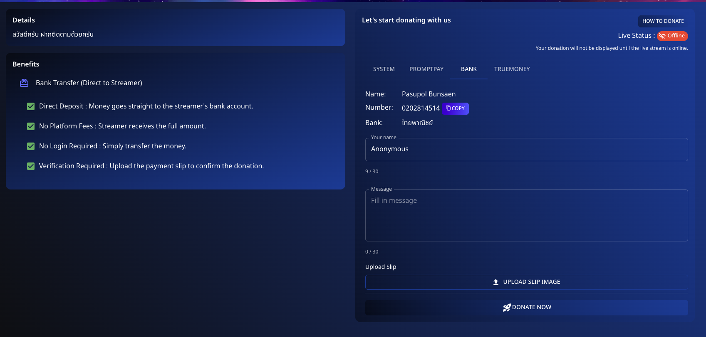

# 💳 How to Donate via Bank Transfer

Directly support your favorite streamers using **Bank Transfer** on **Spectrum Live**. Follow these steps to make a donation:

---

## 📌 Step 1: Prepare Your Transfer

1. Navigate to the **Bank Transfer** option in the donation section.
2. Find the bank details provided:

   - **Name**: [Streamer Name]
   - **Account Number**: [Account Number]
   - **Bank**: [Bank Name]

3. Enter your details:
   - **Name**: Optionally enter your name or remain anonymous.
   - **Message**: Include a personalized message if desired.

---

## 📌 Step 2: Transfer the Amount

1. Use your banking app or service to transfer the donation amount to the provided account details.
2. **Complete the transfer** ensuring all details are accurate.

---

## 📌 Step 3: Upload Payment Confirmation

1. **Upload the payment slip** or transfer confirmation to verify your donation.
2. Click **"Donate Now"** to complete the process.

---

## 💡 Benefits of Using Bank Transfer

- **Direct Deposit**: Money goes straight to the streamer's bank account.
- **No Platform Fees**: Streamer receives the full amount.
- **No Login Required**: Simply transfer the money.
- **Verification**: Upload the payment slip to confirm the donation.

Make a difference with a secure and direct bank transfer to your favorite streamers!

---

Feel free to modify the draft with specific details for your platform.
