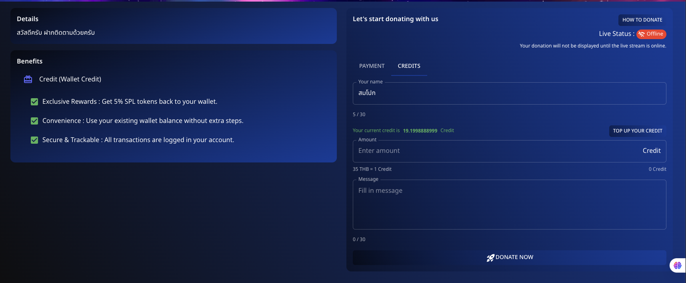
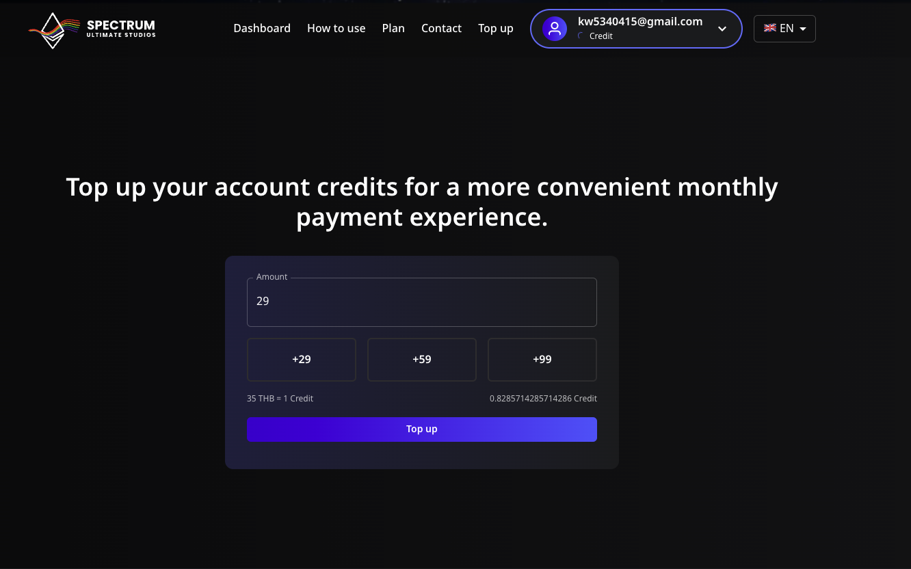
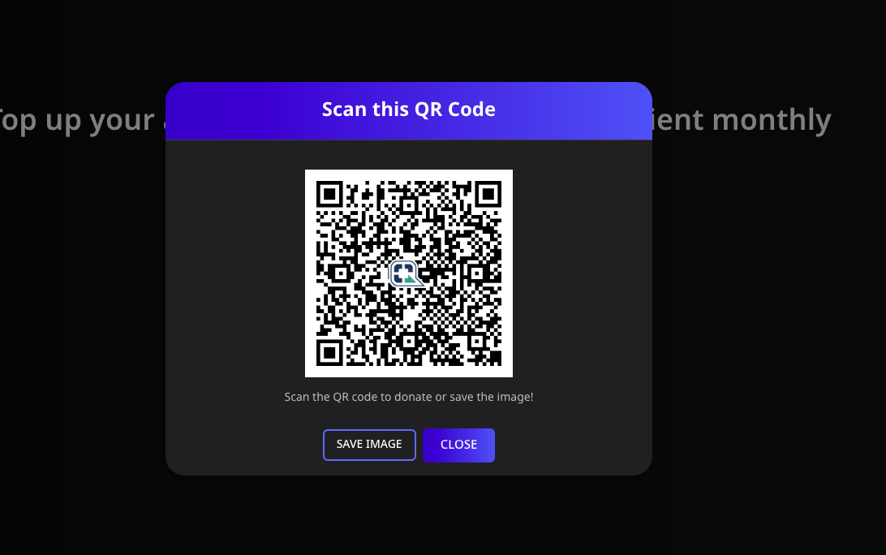

# 💳 How to Donate via Credit

Support your favorite streamers using **Credit** on **Spectrum Live**. Follow the detailed steps below to donate efficiently.

---

## 📌 Step 1: Log In

Go to the **Spectrum Live** platform and [log in](/tutorial-logins/google) to your account.

---

## 📌 Step 2: Top Up Your Credit

1. Navigate to the **Credits** section.
2. Click on **"Top Up Your Credit"**.
3. Enter the desired amount of credit you want to top up.
4. **Scan the QR code** provided to complete the payment.
   
5. Once the payment is successful, your account will be credited.

---

## 📌 Step 3: Prepare Your Donation

1. Return to the **donation section**.
2. Enter your details:
   - **Name**: Enter your name or choose to remain anonymous.
   - **Amount**: Specify the amount of credit you wish to donate.
   - **Message**: Include a personal message if desired.

---

## 📌 Step 4: Donate

1. Ensure all details are correct.
2. Click **"Donate Now"** to send your credit to the streamer.

---

## 💡 Benefits of Using Credit

- **Exclusive Rewards**: Get **5% SPL tokens** back to your wallet.
- **Convenience**: Use your existing wallet balance without extra steps.
- **Secure & Trackable**: All transactions are logged in your account.

Experience a seamless donation process with the convenience of credit!

---

Let me know if there's anything else you'd like to add or adjust!
