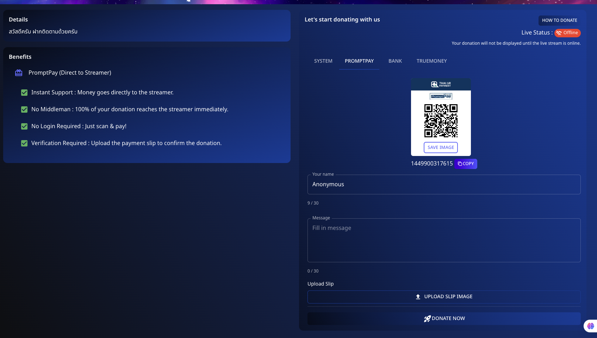

# 💸 How to Donate via PromptPay

Support your favorite streamers directly and efficiently using **PromptPay** on **Spectrum Live**. Here's how you can donate using this method:

---

## 📌 Step 1: Prepare Your Donation

1. Navigate to the **PromptPay** option in the donation section.
2. Enter your details:
   - **Name**: You can choose to input your name or donate anonymously.
   - **Message**: Include a personal message for the streamer.

---

## 📌 Step 2: Scan and Pay

1. **Scan the QR code** displayed on your screen using any mobile payment app that supports PromptPay.
2. **Complete the payment** through your banking app to ensure the donation is sent directly to the streamer.

---

## 📌 Step 3: Upload Payment Confirmation

1. **Upload the payment slip** or screenshot to verify your donation.
2. Click **"Donate Now"** to finalize.

---

## 💡 Benefits of Using PromptPay

- **Instant Support**: Money goes directly to the streamer.
- **No Middleman**: 100% of your donation reaches the streamer immediately.
- **No Login Required**: Just scan and pay!
- **Verification**: Upload the payment slip to confirm the donation.

Enjoy a seamless and direct way to support your favorite streamers today!

---

Feel free to modify this draft or add any additional details specific to your platform.