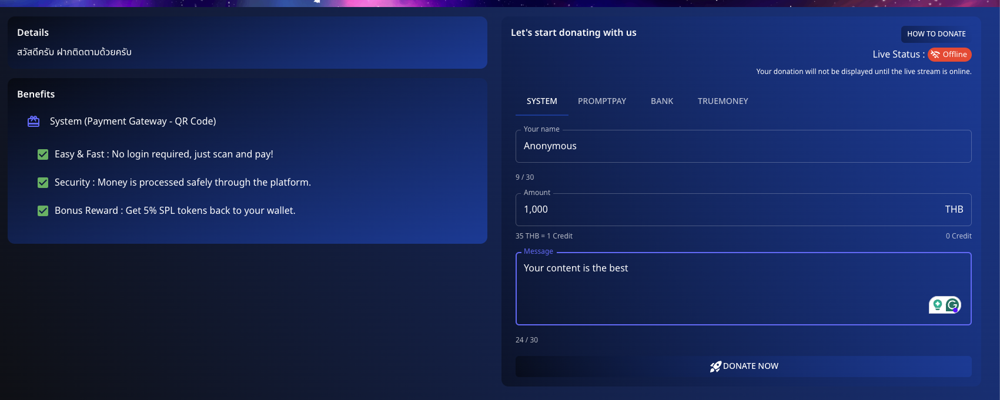

---

sidebar_position: 1
---

# 🎁 How to Donate via System

Donating to your favorite content creators on **Spectrum Live** is straightforward and rewarding. Follow these simple steps to contribute effortlessly.

---

## 📌 Step 1: Fill in the Donation Form

1. **Get the donation link** from the streamer and open it.
2. Enter your details:
   - **Name**: Input your name or stay anonymous.
   - **Amount**: Specify your donation amount.
   - **Message**: Add a personal message if desired.
3. Click **"Donate Now"** to proceed.

---

## 📌 Step 2: Scan the QR Code

1. A **QR code** will be displayed on your screen after completing the form.
2. Use a mobile device to **scan the QR code**.
3. Follow the payment instructions to finalize your donation.

---

## 💡 Benefits of Donating via System

- **Easy & Fast**: No login required, just scan and pay!
- **Security**: Money is processed securely through the platform.
- **Bonus Reward**: Get **5% SPL tokens** back to your wallet.

Support your favorite streamer today and enjoy secure transactions with added rewards!

