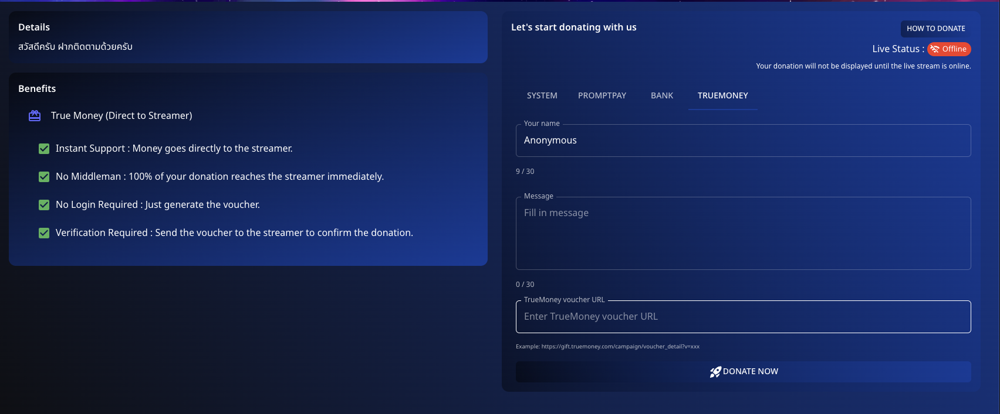

# 🎟️ How to Donate via Truemoney

Donate easily using a **Truemoney** on **Spectrum Live**. Follow these steps to support streamers directly.

---

## 📌 Step 1: Prepare Your Voucher

1. Navigate to the **Truemoney** option in the donation section.
2. Enter your details:
   - **Name**: Optionally provide your name or remain anonymous.
   - **Message**: Add a personalized message if desired.

---

## 📌 Step 2: Generate and Use Voucher

1. **Generate a TrueMoney Voucher** from your TrueMoney account or vendor.
2. Enter the **TrueMoney voucher URL** in the provided field.

---

## 📌 Step 3: Confirm Your Donation

1. **Submit the voucher code** to ensure the donation is credited.
2. Click **"Donate Now"** to finalize the process.

---

## 💡 Benefits of Using TrueMoney Voucher

- **Instant Support**: Money goes directly to the streamer.
- **No Middleman**: 100% of your donation reaches the streamer immediately.
- **No Login Required**: Just generate the voucher.
- **Verification**: Send the voucher to confirm the donation.

Support your favorite content creators quickly and securely with TrueMoney Vouchers!

---

Feel free to customize this draft with more details specific to your platform.
