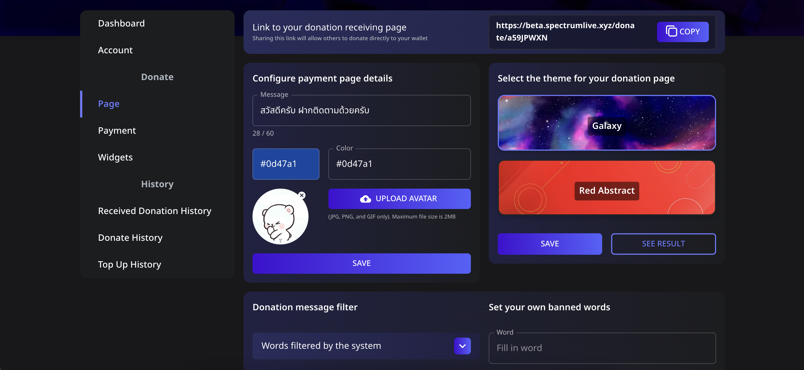

# 🎨 How to Customize Your Donation Page

In **Spectrum Live**, streamers can personalize their **donation page** to match their branding and preferences. This includes setting a cover image, avatar, theme, and filtering inappropriate words from donation messages.

---

## 📌 Step 1: Access the Donation Page Settings

1. **Log in** to your Spectrum Live account.
2. Click on **Page** in the sidebar.
3. You will see customization options, including:
   - **Message** (A short text message for donors)
   - **Page Colors** (Customize the color theme)
   - **Upload Avatar** (Your profile image for the donation page)
   - **Select Theme** (Choose from available themes like Galaxy or Red Abstract)

---

## 📌 Step 2: Customize Your Donation Page

### **1️⃣ Set a Welcome Message**

1. Locate the **Message** box.
2. Enter a short message to display on the donation page (e.g., “Thank you for your support!”).

### **2️⃣ Set a Page Color**

1. Click on the **Color Picker** to choose a color that matches your brand.
2. The selected color will apply to your donation page’s background.

### **3️⃣ Upload an Avatar**

1. Click **UPLOAD AVATAR**.
2. Select a JPG, PNG, or GIF file (Max size: 2MB).
3. The avatar will appear on your donation page.

### **4️⃣ Choose a Theme**

1. Select a theme from the available options (e.g., **Galaxy** or **Red Abstract**).
2. Click **SAVE** to apply the changes.

---

## 📌 Step 3: Set Up a Donation Message Filter

To prevent inappropriate or unwanted messages from appearing in donation alerts, you can enable the **Donation Message Filter**.

### **1️⃣ Use System-Filtered Words**

1. Click on the **Words filtered by the system** dropdown.
2. This will automatically block commonly banned words from appearing in donation messages.

### **2️⃣ Add Custom Banned Words**

1. In the **Set your own banned words** section, enter a word you want to block.
2. Click **ADD NEW WORD**.
3. Any donation message containing the banned word will **not** be displayed or read aloud.

---

## ✅ Save and Preview Your Donation Page

1. Click **SAVE** to apply all changes.
2. Click **SEE RESULT** to preview how your donation page looks to donors.

🎉 Now your donation page is fully customized and ready to receive donations! 🚀
