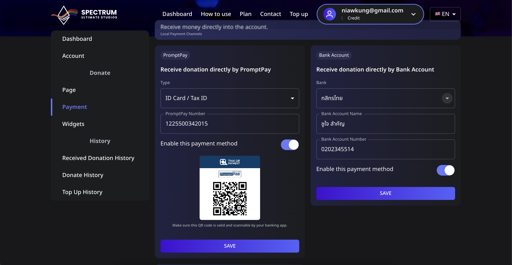
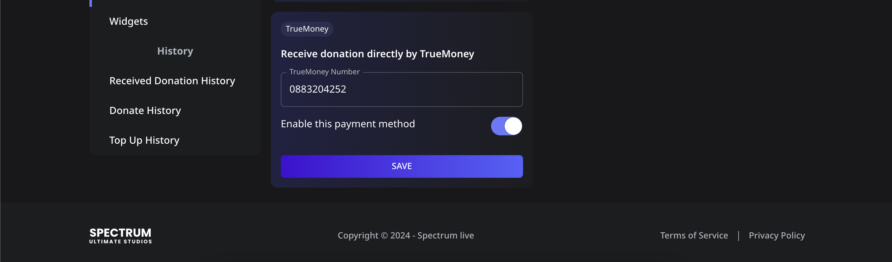

# 💳 How to Set Up Payment Methods

In **Spectrum Live**, streamers can receive donations directly via different payment methods. Once a payment method is set up and enabled, it will be displayed on the donation page for donors to use.

## 📌 Available Payment Methods

- **PromptPay** (Using Mobile Number or ID Card)
- **Bank Account** (Supported banks include ไทยพาณิชย์, กสิกรไทย, and more)
- **TrueMoney** (Using a phone number)

---

## 📌 Step 1: Navigate to the Payment Settings

1. **Log in** to your Spectrum Live account.
2. Click on **Payment** in the sidebar.
3. You will see different sections for **PromptPay**, **Bank Account**, and **TrueMoney**.

---

## 📌 Step 2: Set Up a Payment Method

### **1️⃣ Setting Up PromptPay**

1. In the **PromptPay** section, select the type of PromptPay ID (**Mobile Number** or **ID Card/Tax ID**).
2. Enter the corresponding **PromptPay Number**.
3. Toggle the **Enable this payment method** switch to **ON**.
4. Click the **SAVE** button.
5. A **QR Code** will be generated for donors to scan and send payments.

### **2️⃣ Setting Up a Bank Account**

1. In the **Bank Account** section, select your **Bank Name** (e.g., ไทยพาณิชย์, กสิกรไทย).
2. Enter your **Bank Account Name** (e.g., your full name).
3. Enter your **Bank Account Number**.
4. Toggle the **Enable this payment method** switch to **ON**.
5. Click the **SAVE** button.

### **3️⃣ Setting Up TrueMoney**

1. In the **TrueMoney** section, enter your **TrueMoney Phone Number**.
2. Toggle the **Enable this payment method** switch to **ON**.
3. Click the **SAVE** button.

---

## 📌 Step 3: Verify Your Payment Methods

1. Once a payment method is enabled, it will be **visible on your donation page**.
2. Donors will see the available options and use them to send donations.
3. If you wish to disable a method, simply toggle the **Enable this payment method** switch to **OFF** and save the changes.

---

## ⚠️ Troubleshooting

- **Payment method not showing on the donation page?**
  - Ensure the method is **enabled**.
  - Refresh the donation page to reflect updates.
- **Entered incorrect details?**
  - Edit the payment details and click **SAVE** again.

Now, your donation payment methods are set up and ready for donors to use! 🚀
