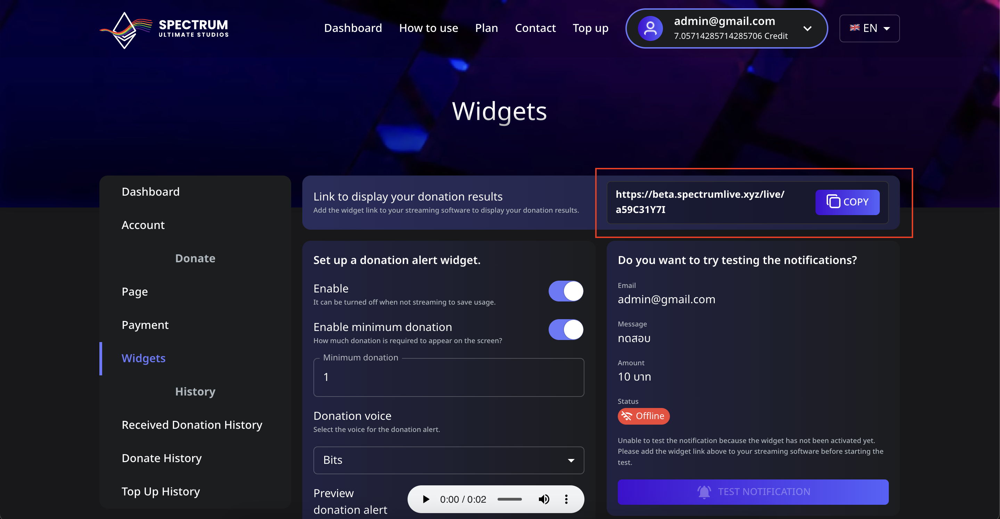

# 📖 How to Copy the Widget Link for Your Streaming App

Widgets in **Spectrum Live** allow streamers to display donation alerts during live broadcasts. This guide will show you how to copy your widget link and add it to streaming software like **OBS Studio** or **Streamlabs**.

---

## 📌 Step 1: Find Your Widget Link

1. **Log in** to your Spectrum Live account.
2. Navigate to the **Widgets** menu from the sidebar.
3. At the top of the page, you’ll see a section labeled **"Link to display your donation results."**
4. Click the **COPY** button to copy your unique widget URL.

---

## 📌 Add the Widget to OBS Studio

1. **Open OBS Studio**.
2. In the **Sources** panel, click the ➕ **Add Source** button.
3. Select **Browser** and give it a name (e.g., "Spectrum Live Donation Widget").
4. Paste the copied URL into the **URL field**.
5. Set the **width** to `800` and **height** to `600` (recommended settings, adjust as needed).
6. Click **OK** to save.

✅ Your donation widget is now integrated into OBS!

---

## 📌 Add the Widget to Streamlabs

1. **Open Streamlabs** and go to the **Editor** tab.
2. Click the ➕ **Add Source** button and select **Browser Source**.
3. Paste the copied **widget link** in the **URL field**.
4. Adjust the width and height if necessary.
5. Click **Done** to save.

🎉 Now, your donation widget will appear during live streams!

---

## 🔄 Test Your Widget

To ensure everything works:

1. Go back to the **Widgets** page on Spectrum Live.
2. Look for the **"Test Notification"** button.
3. If your widget is correctly set up, clicking the button will trigger a test alert on your stream.

⚠️ **Troubleshooting Tip**  
If the status says **"Offline"**, make sure you've added the widget URL to your streaming software and activated it.

---

## 💡 Next Steps

Now that your widget is added, you can:

- **Customize donation alerts** (colors, sounds, animations)
- **Set minimum donation amounts** for alerts
- \*\*Enable text-to-speech (TTS) for donations)

Explore the **Widgets** menu to personalize your stream experience!
