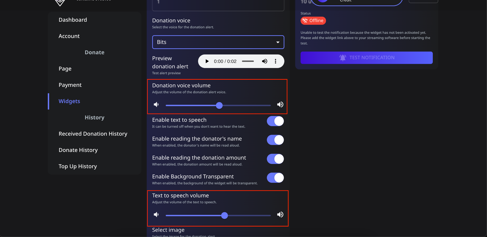

# 📖 How to Set Donation Voice and Text-to-Speech Volume

In **Spectrum Live**, you can customize the volume for two different audio notifications:

- **Donation Voice Volume**: The alert sound that plays when a donation is received.
- **Text-to-Speech (TTS) Volume**: The voice that reads out the donor's name and amount.

Follow these steps to adjust these settings:

---

## 📌 Step 1: Navigate to the Volume Settings

1. **Log in** to your Spectrum Live account.
2. Click on **Widgets** in the sidebar.
3. Scroll down to find the **Donation Voice Volume** and **Text-to-Speech Volume** settings.

---

## 📌 Step 2: Adjust the Donation Voice Volume

1. Locate the **Donation Voice Volume** slider.
2. Drag the slider left to decrease the volume or right to increase it.
3. This controls the alert sound that plays when a donation is received.
4. Available **Donation Voice Types**:
   - **Bits**
   - **Coin**
   - **Multi Coin**
   - **Alert**
5. Choose the donation voice type that best fits your stream.
6. Click **Save** to apply the changes.

---

## 📌 Step 3: Adjust the Text-to-Speech (TTS) Volume

1. Scroll down to the **Text-to-Speech Volume** section.
2. Drag the slider left to lower the TTS volume or right to increase it.
3. This controls the voice that reads the donor's name and donation amount.
4. Click **Save** to apply the changes.

---

## 🔄 Test Your Settings

1. Once adjustments are made, preview the changes:
   - Click the **Test Notification** button.
   - Listen to ensure the **Donation Voice** and **TTS Volume** are at the desired levels.
2. If necessary, fine-tune the sliders to get the perfect balance.

---

## ⚠️ Troubleshooting

- **Too loud or too soft?** Adjust the sliders gradually to match your stream’s audio balance.
- **Want to disable text-to-speech?** Toggle **Enable Text-to-Speech** to **OFF**.

Now, your donation alerts will sound just right for your stream! 🚀
