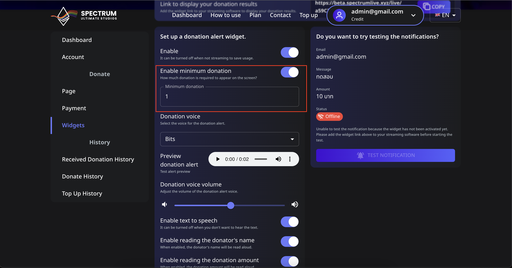

# 📖 How to Set the Minimum Donation Amount to Appear on Screen

You can control the minimum donation amount required for it to show up on your stream. Follow these steps to set it up:

---

## 📌 Step 1: Navigate to the Minimum Donation Setting

1. **Log in** to your Spectrum Live account.
2. Click on **Widgets** in the sidebar.
3. Locate the **"Enable minimum donation"** setting.
4. Toggle the switch **ON** to activate this feature.

---

## 📌 Step 2: Set Your Minimum Donation Amount

1. In the **Minimum donation** field, enter the amount you want as the threshold (e.g., `1`, `5`, or `10`).
2. This ensures that only donations equal to or above this amount will trigger an alert on your stream.
3. Click **Save** to apply the changes.

---

## 📌 Step 3: Test the Minimum Donation

1. Go to the **Test Notification** section.
2. Enter a donation amount below your set minimum and try triggering an alert.
3. If it does **not** appear, the setting is working correctly.
4. Enter a donation amount above the minimum and test again to see the alert.

---

## ⚠️ Troubleshooting

- **Alerts not appearing?** Make sure the widget is correctly added to OBS or Streamlabs.
- **Want to disable the limit?** Toggle the **Enable minimum donation** switch **OFF**.

With this feature, you can ensure only significant donations appear, keeping your alerts clean and impactful! 🚀
