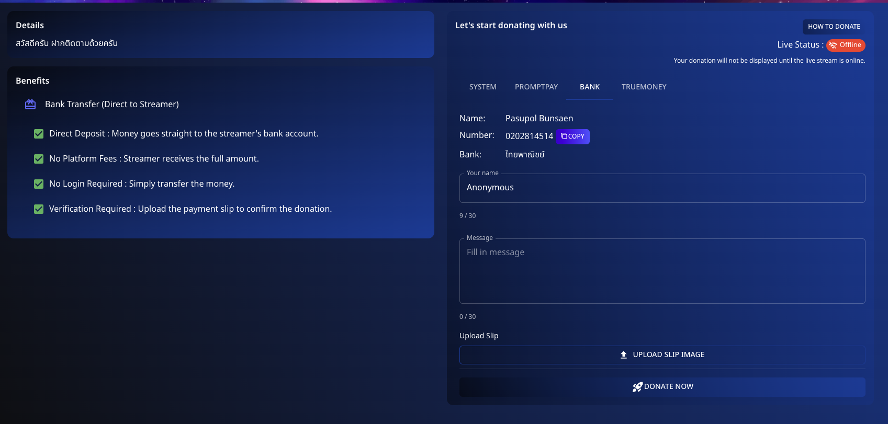

# 💳 วิธีการโดเนทผ่านการโอนเงินผ่านธนาคาร

สนับสนุนสตรีมเมอร์ที่คุณชื่นชอบโดยตรงผ่าน **การโอนเงินผ่านธนาคาร** บน **Spectrum Live** ทำตามขั้นตอนเหล่านี้เพื่อทำการโดเนท:

---

## 📌 ขั้นตอนที่ 1: เตรียมการโอนเงินของคุณ

1. ไปที่ตัวเลือก **การโอนเงินผ่านธนาคาร** ในส่วนการโดเนท
2. ค้นหารายละเอียดธนาคารที่มีให้:

   - **ชื่อ**: [ชื่อสตรีมเมอร์]
   - **เลขที่บัญชี**: [เลขที่บัญชี]
   - **ธนาคาร**: [ชื่อธนาคาร]

3. กรอกรายละเอียดของคุณ:
   - **ชื่อ**: กรอกชื่อของคุณหรือไม่ระบุชื่อ
   - **ข้อความ**: รวมข้อความส่วนตัวถ้าต้องการ

---

## 📌 ขั้นตอนที่ 2: โอนจำนวนเงิน

1. ใช้แอปธนาคารหรือบริการของคุณเพื่อโอนจำนวนเงินโดเนทไปยังรายละเอียดบัญชีธนาคารที่ให้ไว้
2. **ดำเนินการโอนให้เสร็จสิ้น** โดยตรวจสอบให้แน่ใจว่ารายละเอียดทั้งหมดถูกต้อง

---

## 📌 ขั้นตอนที่ 3: อัปโหลดเอกสารยืนยันการชำระเงิน

1. **อัปโหลดสลิปการโอนเงิน** หรือเอกสารยืนยันการโอนเพื่อยืนยันการโดเนทของคุณ
2. คลิก **"โดเนทเลย"** เพื่อทำกระบวนการให้เสร็จสิ้น

---

## 💡 ข้อดีของการใช้การโอนเงินผ่านธนาคาร

- **การฝากตรง**: เงินจะเข้าบัญชีธนาคารของสตรีมเมอร์โดยตรง
- **ไม่มีค่าธรรมเนียมแพลตฟอร์ม**: สตรีมเมอร์จะได้รับเต็มจำนวน
- **ไม่ต้องเข้าสู่ระบบ**: เพียงแค่โอนเงิน
- **การยืนยัน**: อัปโหลดสลิปการโอนเพื่อยืนยันการโดเนท

สร้างความแตกต่างด้วยการโอนเงินผ่านธนาคารที่ปลอดภัยและตรงไปยังสตรีมเมอร์ที่คุณชื่นชอบ!

---