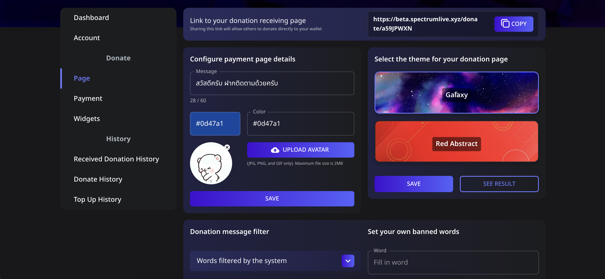

# 🎨 วิธีปรับแต่งหน้าการโดเนทของคุณ

ใน **Spectrum Live** สตรีมเมอร์สามารถปรับแต่ง **หน้าการโดเนท** ให้ตรงกับแบรนด์และความชื่นชอบของตนเองได้ ซึ่งรวมถึงการตั้งค่าภาพหน้าปก อวาตาร์ ธีม และการกรองคำไม่เหมาะสมจากข้อความโดเนท

---

## 📌 ขั้นตอนที่ 1: เข้าถึงการตั้งค่าหน้าการโดเนท

1. **เข้าสู่ระบบ** บัญชี Spectrum Live ของคุณ
2. คลิกที่ **Page** ในแถบด้านข้าง
3. คุณจะเห็นตัวเลือกการปรับแต่งต่าง ๆ รวมถึง:
   - **Message** (ข้อความสั้นสำหรับผู้โดเนท)
   - **Page Colors** (ปรับแต่งสีธีม)
   - **Upload Avatar** (รูปภาพโปรไฟล์สำหรับหน้าการโดเนท)
   - **Select Theme** (เลือกจากธีมที่มี เช่น Galaxy หรือ Red Abstract)

---

## 📌 ขั้นตอนที่ 2: ปรับแต่งหน้าการโดเนทของคุณ

### **1️⃣ ตั้งค่าข้อความต้อนรับ**

1. ค้นหากล่อง **Message**
2. กรอกข้อความสั้น ๆ ที่จะแสดงบนหน้าการโดเนท (เช่น “ขอบคุณสำหรับการสนับสนุน!”)

### **2️⃣ ตั้งค่าสีของหน้า**

1. คลิกที่ **Color Picker** เพื่อเลือกสีที่ตรงกับแบรนด์ของคุณ
2. สีที่เลือกจะถูกใช้ในพื้นหลังของหน้าการโดเนทของคุณ

### **3️⃣ อัปโหลดอวาตาร์**

1. คลิก **UPLOAD AVATAR**
2. เลือกไฟล์ JPG, PNG หรือ GIF (ขนาดสูงสุด: 2MB)
3. อวาตาร์จะปรากฏบนหน้าการโดเนทของคุณ

### **4️⃣ เลือกธีม**

1. เลือกธีมจากตัวเลือกที่มี (เช่น **Galaxy** หรือ **Red Abstract**)
2. คลิก **SAVE** เพื่อบันทึกการเปลี่ยนแปลง

---

## 📌 ขั้นตอนที่ 3: ตั้งค่าตัวกรองข้อความโดเนท

เพื่อป้องกันข้อความที่ไม่เหมาะสมหรือไม่ต้องการไม่ให้ปรากฏในการแจ้งเตือนการโดเนท คุณสามารถเปิดใช้ **Donation Message Filter**

### **1️⃣ ใช้คำที่ถูกกรองโดยระบบ**

1. คลิกที่เมนู **Words filtered by the system**
2. ระบบจะบล็อกคำที่ห้ามใช้ทั่วไปไม่ให้ปรากฏในข้อความโดเนทโดยอัตโนมัติ

### **2️⃣ เพิ่มคำห้ามเอง**

1. ในส่วน **Set your own banned words** กรอกคำที่คุณต้องการบล็อก
2. คลิก **ADD NEW WORD**
3. ข้อความโดเนทใด ๆ ที่มีคำห้ามจะ **ไม่** ถูกแสดงหรืออ่านออกเสียง

---

## ✅ บันทึกและดูตัวอย่างหน้าการโดเนทของคุณ

1. คลิก **SAVE** เพื่อบันทึกการเปลี่ยนแปลงทั้งหมด
2. คลิก **SEE RESULT** เพื่อดูตัวอย่างว่าหน้าการโดเนทของคุณจะดูเป็นอย่างไรสำหรับผู้โดเนท

🎉 แล้วหน้าการโดเนทของคุณก็พร้อมที่จะรับการโดเนทแล้ว! 🚀