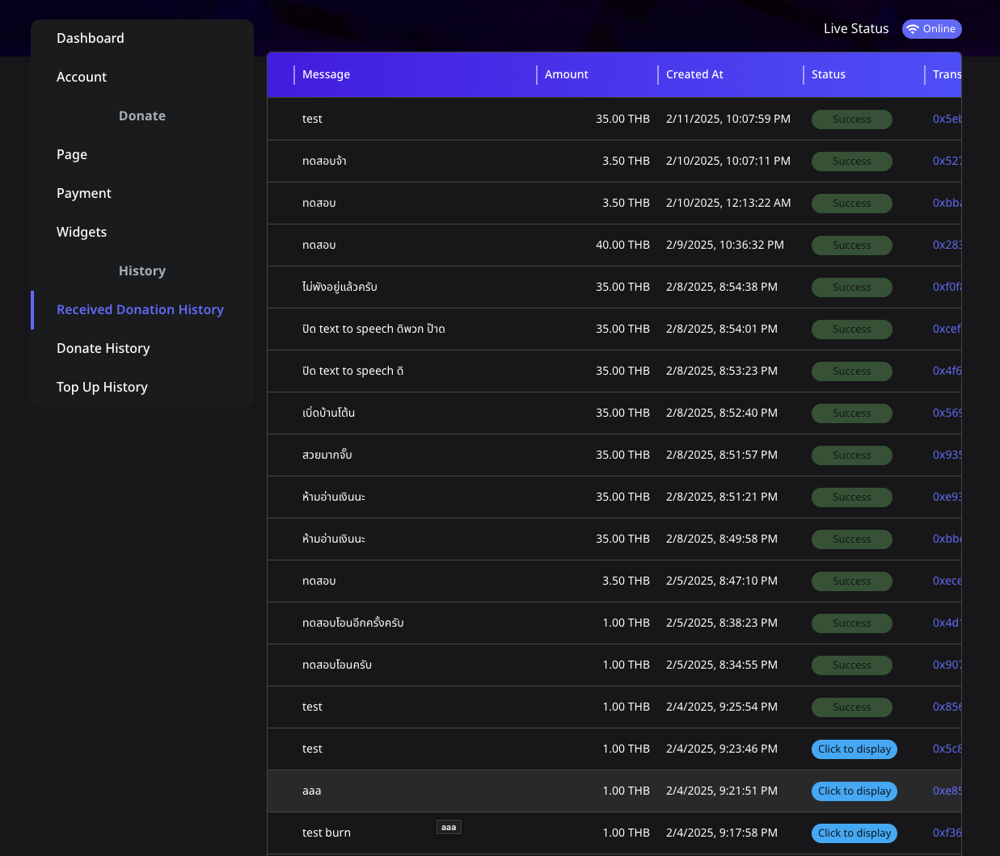

# 🖥️ แสดงข้อความโดเนทที่ยังไม่แสดง

สตรีมเมอร์บน **Spectrum Live** สามารถจัดการและแสดงข้อความโดเนทได้ง่าย ๆ ผ่านแผงควบคุม ตามขั้นตอนดังนี้:

---

## 📌 ขั้นตอนที่ 1: เข้าถึงแผงควบคุมของคุณ

1. เข้าสู่ระบบบัญชี **Spectrum Live** ของคุณ
2. ไปที่ **แผงควบคุม** ในเมนูด้านบนซ้าย

---

## 📌 ขั้นตอนที่ 2: ตรวจสอบประวัติการโดเนทของคุณ

1. คลิกที่ **ประวัติการโดเนทที่ได้รับ** ในแถบด้านข้าง
2. ดูธุรกรรมการโดเนททั้งหมด รวมถึง:
   - **ผู้โดเนท**: ชื่อของผู้โดเนท
   - **ข้อความ**: เนื้อหาจากผู้โดเนท
   - **จำนวนเงิน**: มูลค่าการโดเนท
   - **สร้างเมื่อ**: วันที่และเวลาของการโดเนท
   - **สถานะ**: สำเร็จหรือรออยู่
   - **ธุรกรรม**: ลิงค์ที่คลิกได้สำหรับรายละเอียดธุรกรรม

---

## 📌 ขั้นตอนที่ 3: แสดงข้อความโดเนทที่ยังไม่แสดง

1. ตรวจสอบให้แน่ใจว่าการสตรีมสดของคุณอยู่ในสถานะ **ออนไลน์**
2. ค้นหาข้อความที่มีปุ่ม **"คลิกเพื่อแสดง"**
3. คลิก **"คลิกเพื่อแสดง"** เพื่อเรียกใช้การแสดงข้อความโดเนทที่รออยู่

---

## 💡 เคล็ดลับสำหรับสตรีมเมอร์

- ตรวจสอบให้แน่ใจว่าการสตรีมของคุณอยู่ในสถานะ **ออนไลน์** ก่อนแสดงข้อความเพื่อหลีกเลี่ยงการขัดจังหวะ
- ตรวจสอบประวัติการโดเนทของคุณเป็นประจำเพื่อจัดการข้อความที่ยังไม่แสดงให้ครบถ้วน

รักษาการมีส่วนร่วมของผู้ชมและรับรู้การสนับสนุนของพวกเขาด้วยการจัดการและแสดงข้อความโดเนทอย่างรวดเร็ว!

---