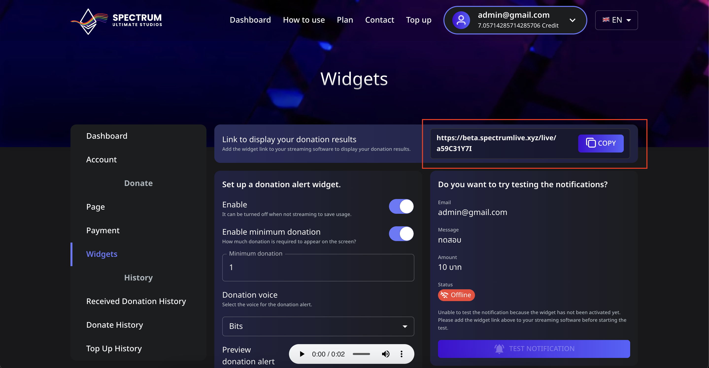

# 📖 วิธีคัดลอกลิงก์วิดเจ็ตสำหรับแอปสตรีมมิ่งของคุณ

วิดเจ็ตใน **Spectrum Live** อนุญาตให้สตรีมเมอร์แสดงการแจ้งเตือนโดเนทระหว่างการถ่ายทอดสด คู่มือนี้จะแสดงวิธีคัดลอกลิงก์วิดเจ็ตของคุณและเพิ่มลงในซอฟต์แวร์สตรีมมิ่งเช่น **OBS Studio** หรือ **Streamlabs**

---

## 📌 ขั้นตอนที่ 1: ค้นหาลิงก์วิดเจ็ตของคุณ

1. **เข้าสู่ระบบ** บัญชี Spectrum Live ของคุณ
2. ไปที่เมนู **Widgets** จากแถบด้านข้าง
3. ที่ด้านบนของหน้า จะแสดงส่วนที่มีป้ายกำกับ **"ลิงก์เพื่อแสดงผลการโดเนทของคุณ"**
4. คลิกปุ่ม **COPY** เพื่อคัดลอก URL วิดเจ็ตเฉพาะของคุณ

---

## 📌 เพิ่มวิดเจ็ตใน OBS Studio

1. **เปิด OBS Studio**
2. ในแผง **Sources** คลิกที่ปุ่ม ➕ **Add Source**
3. เลือก **Browser** และตั้งชื่อให้มัน (เช่น "Spectrum Live Donation Widget")
4. วาง URL ที่คัดลอกลงใน **ช่อง URL**
5. ตั้งค่า **ความกว้าง** เป็น `800` และ **ความสูง** เป็น `600` (การตั้งค่าแนะนำ ปรับตามต้องการ)
6. คลิก **OK** เพื่อบันทึก

✅ ตอนนี้วิดเจ็ตโดเนทของคุณรวมเข้ากับ OBS แล้ว!

---

## 📌 เพิ่มวิดเจ็ตใน Streamlabs

1. **เปิด Streamlabs** และไปที่แท็บ **Editor**
2. คลิกปุ่ม ➕ **Add Source** และเลือก **Browser Source**
3. วาง **ลิงก์วิดเจ็ต** ใน **ช่อง URL**
4. ปรับความกว้างและความสูงตามความจำเป็น
5. คลิก **Done** เพื่อบันทึก

🎉 ตอนนี้วิดเจ็ตโดเนทของคุณจะปรากฏในระหว่างการสตรีมสด!

---

## 🔄 ทดสอบวิดเจ็ตของคุณ

เพื่อให้แน่ใจว่าทุกอย่างทำงาน:

1. กลับไปที่หน้าวิดเจ็ตใน Spectrum Live
2. มองหาปุ่ม **"Test Notification"**
3. หากวิดเจ็ตของคุณตั้งค่าอย่างถูกต้อง การคลิกปุ่มจะทำให้เกิดการแจ้งเตือนทดสอบบนสตรีมของคุณ

⚠️ **เคล็ดลับการแก้ปัญหา**  
หากสถานะปรากฏว่า **"ออฟไลน์"** ตรวจสอบให้แน่ใจว่าคุณได้เพิ่ม URL วิดเจ็ตไปยังซอฟต์แวร์สตรีมมิ่งและเปิดใช้งานแล้ว

---

## 💡 ขั้นตอนถัดไป

ตอนนี้วิดเจ็ตของคุณถูกเพิ่มแล้ว คุณสามารถ:

- **ปรับแต่งการแจ้งเตือนโดเนท** (สี เสียง แอนิเมชัน)
- **ตั้งค่าจำนวนเงินโดเนทขั้นต่ำ** สำหรับการแจ้งเตือน
- **เปิดใช้การอ่านออกเสียงข้อความ (TTS) สำหรับการโดเนท**

สำรวจเมนู **Widgets** เพื่อปรับแต่งประสบการณ์การสตรีมของคุณ!