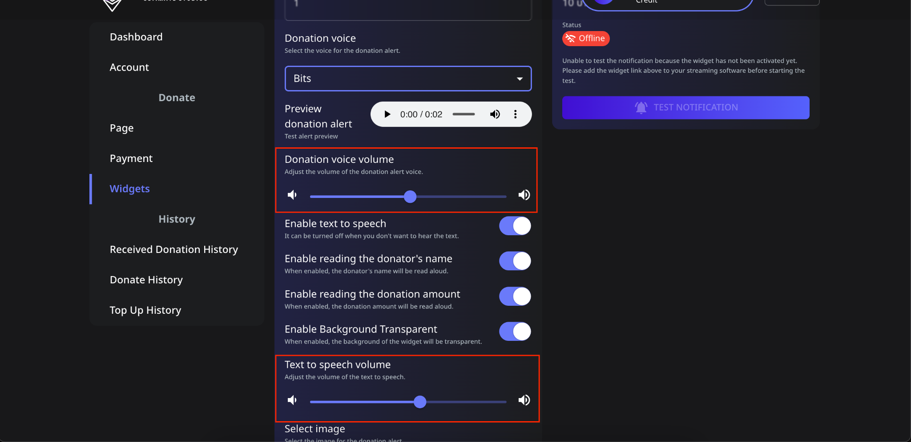

# 📖 วิธีตั้งค่าเสียงโดเนทและระดับเสียง Text-to-Speech

ใน **Spectrum Live** คุณสามารถปรับแต่งระดับเสียงสำหรับการแจ้งเตือนสองแบบต่าง ๆ ได้:

- **ระดับเสียงของเสียงโดเนท**: เสียงแจ้งเตือนที่เล่นเมื่อได้รับโดเนท
- **ระดับเสียง Text-to-Speech (TTS)**: เสียงที่อ่านชื่อและจำนวนของผู้โดเนท

ทำตามขั้นตอนเหล่านี้เพื่อปรับการตั้งค่า:

---

## 📌 ขั้นตอนที่ 1: ไปที่การตั้งค่าระดับเสียง

1. **เข้าสู่ระบบ** บัญชี Spectrum Live ของคุณ
2. คลิกที่ **Widgets** ในแถบด้านข้าง
3. เลื่อนลงเพื่อค้นหาการตั้งค่า **ระดับเสียงของเสียงโดเนท** และ **ระดับเสียง Text-to-Speech**

---

## 📌 ขั้นตอนที่ 2: ปรับระดับเสียงของเสียงโดเนท

1. ค้นหาแถบเลื่อน **ระดับเสียงของเสียงโดเนท**
2. ลากแถบเลื่อนไปทางซ้ายเพื่อลดระดับเสียงหรือไปทางขวาเพื่อเพิ่มมัน
3. นี่คือการควบคุมเสียงแจ้งเตือนที่เล่นเมื่อได้รับโดเนท
4. **ประเภทเสียงโดเนท** ที่มี:
   - **Bits**
   - **Coin**
   - **Multi Coin**
   - **Alert**
5. เลือกประเภทเสียงโดเนทที่เหมาะสมกับสตรีมของคุณมากที่สุด
6. คลิก **Save** เพื่อบันทึกการเปลี่ยนแปลง

---

## 📌 ขั้นตอนที่ 3: ปรับระดับเสียง Text-to-Speech (TTS)

1. เลื่อนลงมาที่ส่วน **ระดับเสียง Text-to-Speech**
2. ลากแถบเลื่อนไปทางซ้ายเพื่อลดระดับเสียง TTS หรือไปทางขวาเพื่อเพิ่ม
3. นี่คือการควบคุมเสียงที่อ่านชื่อและจำนวนโดเนท
4. คลิก **Save** เพื่อบันทึกการเปลี่ยนแปลง

---

## 🔄 ทดสอบการตั้งค่าของคุณ

1. เมื่อปรับเรียบร้อยแล้ว ดูตัวอย่างการเปลี่ยนแปลง:
   - คลิกปุ่ม **Test Notification**
   - ฟังว่าเสียง **Donation Voice** และ **TTS Volume** อยู่ในระดับที่ต้องการหรือไม่
2. หากจำเป็นให้ปรับแต่งแถบเลื่อนเพื่อความสมดุลที่สมบูรณ์แบบ

---

## ⚠️ การแก้ไขปัญหา

- **เสียงดังหรือเบาเกินไป?** ปรับแถบเลื่อนอย่างค่อยเป็นค่อยไปเพื่อให้เข้ากับสมดุลเสียงของสตรีมคุณ
- **ต้องการปิดการใช้งาน text-to-speech?** ปิด **Enable Text-to-Speech** เป็น **OFF**

ตอนนี้เสียงแจ้งเตือนโดเนทของคุณจะดังพอดีสำหรับสตรีมของคุณ! 🚀