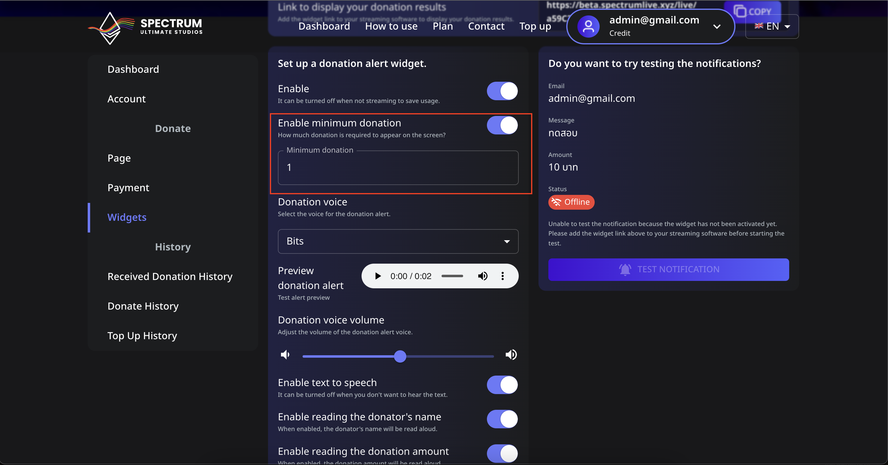

# 📖 How to Set the Minimum Donation Amount to Appear on Screen

You can control the minimum donation amount required for it to show up on your stream. Follow these steps to set it up:
---
sidebar_position: 2
---

# 📖 วิธีตั้งค่าจำนวนเงินโดเนทขั้นต่ำให้แสดงบนหน้าจอ

คุณสามารถควบคุมจำนวนเงินโดเนทขั้นต่ำที่จำเป็นสำหรับการแสดงบนหน้าจอของคุณได้ ทำตามขั้นตอนเหล่านี้เพื่อกำหนดค่า:

---

## 📌 ขั้นตอนที่ 1: ไปที่การตั้งค่าจำนวนเงินโดเนทขั้นต่ำ

1. **เข้าสู่ระบบ** บัญชี Spectrum Live ของคุณ
2. คลิกที่ **Widgets** ในแถบด้านข้าง
3. ค้นหาการตั้งค่า **"เปิดการใช้งานโดเนทขั้นต่ำ"**
4. เปิดสวิตช์เป็น **เปิด** เพื่อเปิดใช้งานฟีเจอร์นี้

---

## 📌 ขั้นตอนที่ 2: ตั้งค่าจำนวนเงินโดเนทขั้นต่ำของคุณ

1. ในช่อง **โดเนทขั้นต่ำ** กรอกจำนวนเงินที่คุณต้องการเป็นเกณฑ์ (เช่น `1`, `5`, หรือ `10`)
2. เพื่อให้แน่ใจว่าเฉพาะโดเนทที่มีจำนวนเท่ากับหรือมากกว่าจำนวนนี้จะทำให้เกิดการแจ้งเตือนบนสตรีมของคุณ
3. คลิก **Save** เพื่อบันทึกการเปลี่ยนแปลง

---

## 📌 ขั้นตอนที่ 3: ทดสอบโดเนทขั้นต่ำ

1. ไปที่ส่วน **Test Notification**
2. กรอกจำนวนเงินโดเนทที่ต่ำกว่าขั้นต่ำที่ตั้งไว้แล้วลองทดสอบการแจ้งเตือน
3. หากมัน **ไม่** ปรากฏ การตั้งค่าก็ทำงานได้อย่างถูกต้อง
4. กรอกจำนวนเงินโดเนทที่มากกว่าขั้นต่ำและทดสอบอีกครั้งเพื่อดูการแจ้งเตือน

---

## ⚠️ การแก้ไขปัญหา

- **การแจ้งเตือนไม่ปรากฏ?** ตรวจสอบให้แน่ใจว่าได้เพิ่มวิดเจ็ตใน OBS หรือ Streamlabs อย่างถูกต้อง
- **ต้องการปิดการจำกัด?** ปิดสวิตช์ **เปิดการใช้งานโดเนทขั้นต่ำ** เป็น **ปิด**

ด้วยฟีเจอร์นี้ คุณจะมั่นใจได้ว่าเฉพาะโดเนทที่มีความหมายเท่านั้นที่จะแสดง ทำให้การแจ้งเตือนของคุณสะอาดและทำงานได้อย่างมีประสิทธิภาพ! 🚀
---

## 📌 Step 1: Navigate to the Minimum Donation Setting

1. **Log in** to your Spectrum Live account.
2. Click on **Widgets** in the sidebar.
3. Locate the **"Enable minimum donation"** setting.
4. Toggle the switch **ON** to activate this feature.

---

## 📌 Step 2: Set Your Minimum Donation Amount

1. In the **Minimum donation** field, enter the amount you want as the threshold (e.g., `1`, `5`, or `10`).
2. This ensures that only donations equal to or above this amount will trigger an alert on your stream.
3. Click **Save** to apply the changes.

---

## 📌 Step 3: Test the Minimum Donation

1. Go to the **Test Notification** section.
2. Enter a donation amount below your set minimum and try triggering an alert.
3. If it does **not** appear, the setting is working correctly.
4. Enter a donation amount above the minimum and test again to see the alert.

---

## ⚠️ Troubleshooting

- **Alerts not appearing?** Make sure the widget is correctly added to OBS or Streamlabs.
- **Want to disable the limit?** Toggle the **Enable minimum donation** switch **OFF**.

With this feature, you can ensure only significant donations appear, keeping your alerts clean and impactful! 🚀
